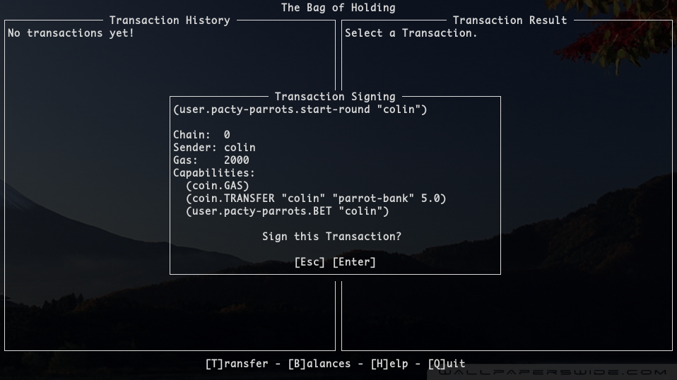

# Changelog for Bag of Holding

## 1.4.0 (2020-01-31)

**New Command:** `boh poll` to easily query the result of a Transaction.

```bash
$ boh poll --node=tetsu.fosskers.ca:443 --chain=0 --tx=Y5yIaENtp5jS_-B3cjmoxdW3HkpDp3d6lRuF0C2sZb0
{
    "gas": 757,
    "result": {
        "status": "success",
        "data": "Write succeeded"
    },
    "reqKey": "Y5yIaENtp5jS_-B3cjmoxdW3HkpDp3d6lRuF0C2sZb0",
    "logs": "avgF5JhbUNCCbnySkpfYSm17ft-Pk4gtAW1JIBee950",
    "metaData": {
        "blockTime": 1580421471913670,
        "prevBlockHash": "jsL8JMWon6CbxOb8KFX0zkW2q9_kPEzdGbFNw_klIPs",
        "blockHash": "PQ5J4vxzV_14tBYqk1p0tNeq5l_-J0BU02VFq7nXL_Y",
        "blockHeight": 268343
    },
    "continuation": null,
    "txId": 318001
}
```

## 1.3.1 (2020-01-22)

Fixed a bug involving trivial failures in transaction signing.

## 1.3.0 (2020-01-22)

`boh` now supports the Pact [Signing
API](https://github.com/kadena-io/signing-api). When `boh` is open, it is
running a small web server on Port 9467. Applications that want a transaction
signature from you will make a request to this port, and an prompt box will
appear for you to confirm or deny the transaction.



## 1.2.0 (2019-12-19)

### New Feature

The new `boh keys` command can be used to generate a key pair in the format that
`boh` expects:

```bash
$ boh keys
{
    "private": "09fbe65c7adb5f4d6928d1544c4a844740a6777cbc57dfeb96286cea63c4a520",
    "public": "007104e41eb2e1284212a2d86debafc67c4a9b5b837913b851b146f6b12fbed4"
}
```

To pipe this to a file for later use:

```bash
$ boh keys > keys.json
```

### Breaking Changes

The old way of opening `boh` to access the Wallet UI now requires the `wallet`
command:

```bash
$ boh wallet --keyfile=keys.json --account=you --node=us-w1.chainweb.com:443
```

## 1.1.1 (2019-12-10)

Fixed a bug involving decimal places entered into the Transfer Wizard.

## 1.1.0 (2019-12-03)

The former `t` command for writing Pact Transactions has been moved to `p`. In
its place, `t` now opens the Transfer Wizard. Use this to easily perform
single-chain transfers without writing your own Pact code.

**Note:** General transactions are still broken, but will be fixed in the next
version.

## 1.0.1 (2019-11-29)

The dependency on `chainweb` has been dropped, vastly reducing the number of
transitive dependencies required by `boh`. This also reduces binary size.
