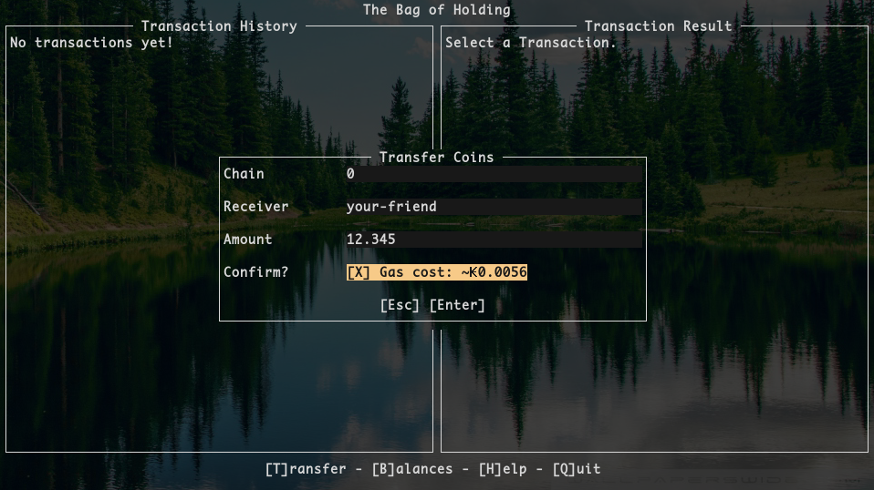

# Bag of Holding

*A terminal wallet for the Kadena Public Blockchain.*



## Installation

`boh` is a Haskell project that builds with the
[Stack](https://docs.haskellstack.org/en/stable/README/) tool.

```
stack install
```

This will place the binary in `~/.local/bin`.

## Usage

```
boh --keyfile=keys.json --account=YOUR-ACCOUNT-NAME --node=us-e1.chainweb.com:443
```

Where `keys.json` has the format:

```json
{
  "private": "YOUR-PRIVATE-KEY",
  "public": "YOUR-PUBLIC-KEY"
}
```

This is not (yet) a secure file format, but `boh` itself is safe to use.
